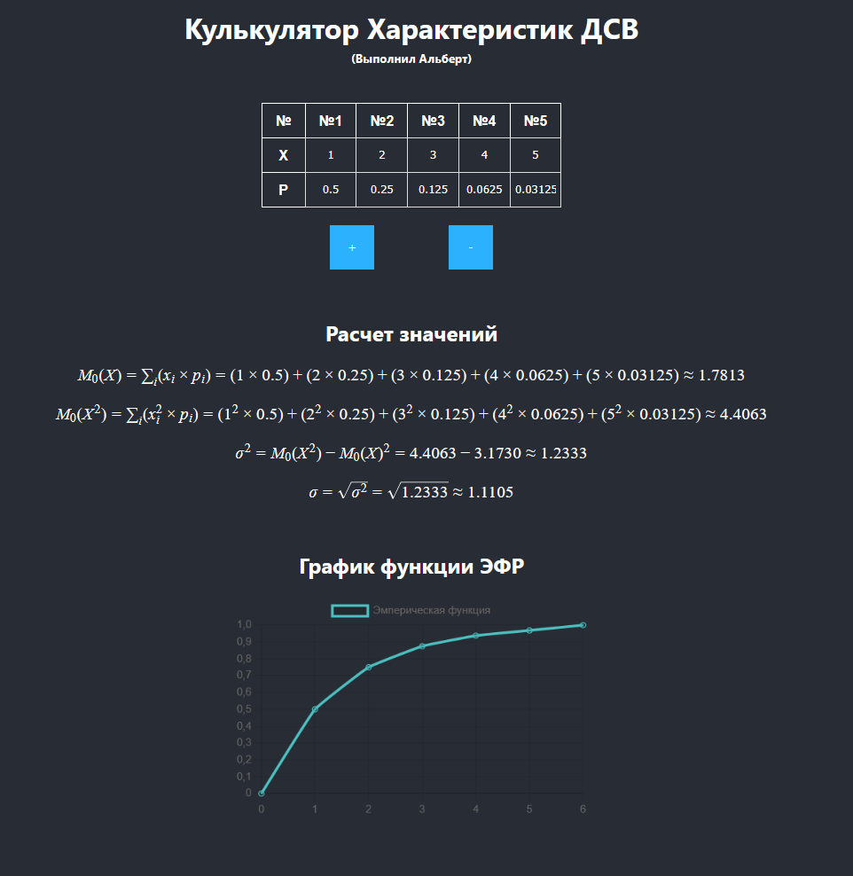

# Калькулятор характеристик ДСВ

Проект выполнен Альбертом (группа: ПИЖ-б-о-23-2-1).  
Калькулятор представляет собой веб-приложение, которое позволяет рассчитывать основные характеристики дискретной случайной величины (ДСВ) на основе введенных пользователем данных. Проект реализован с использованием библиотеки React и вспомогательных инструментов для визуализации математических выражений и графиков.

## Основные функции

- **Ввод данных**: Пользователь может задавать значения случайной величины (X) и соответствующие вероятности (p) через интерактивную таблицу.
- **Управление таблицей**: Добавление и удаление строк в таблице для удобства ввода данных.
- **Расчет характеристик**:
  - Математическое ожидание (M₀)
  - Дисперсия (σ²)
  - Среднеквадратичное отклонение (σ)
- **Визуализация расчетов**: Показывает последовательность математических операций с подстановкой значений.
- **Графическое представление**: Визуализация данных с использованием библиотеки `react-chartjs-2`.



## Используемые технологии

- **React** — библиотека для создания пользовательского интерфейса.
- **Redux** — управление состоянием приложения.
- **KaTeX** — отображение математических формул.
- **Math.js** — выполнение математических вычислений.
- **Chart.js** — построение графиков.

## Структура проекта
```
📁
│ App.jsx
│ index.js
│
├──📁 components
│ │ Calculator.jsx
│ │ Equation.jsx
│ │ TableConrol.jsx
│ │
│ ├📁Table
│ │ Table.jsx
│ │ TableBody.jsx
│ │ TableCell.jsx
│ │ TableHead.jsx
│ │ TableRow.jsx
│ │
│ └📁UI
│   Button.jsx
│   Input.jsx
│
├──📁hooks
│   useCellValue.js
│
├──📁store
│   index.js
│   pArrReducer.js
│   xArrReducer.js
│
└──📁utils
    constants.js
    helpers.js
    math.js
```

## Установка и запуск проекта
1. **Клонируйте репозиторий**:
   ```bash
   git clone https://github.com/Wildcat2k21/casualCalculator.git
   cd ваш-репозиторий
   ```
2. Установите зависимости:
   ```bash
   npm install
   ```
3. Запустите проект:
   ```
   npm run start
   ```
4. Откройте в браузере "http://localhost:3000", чтобы увидеть проект в действии.

Этот проект распространяется под лицензией MIT
Разработано Альбертом (ПИЖ-б-о-23-2-1)
